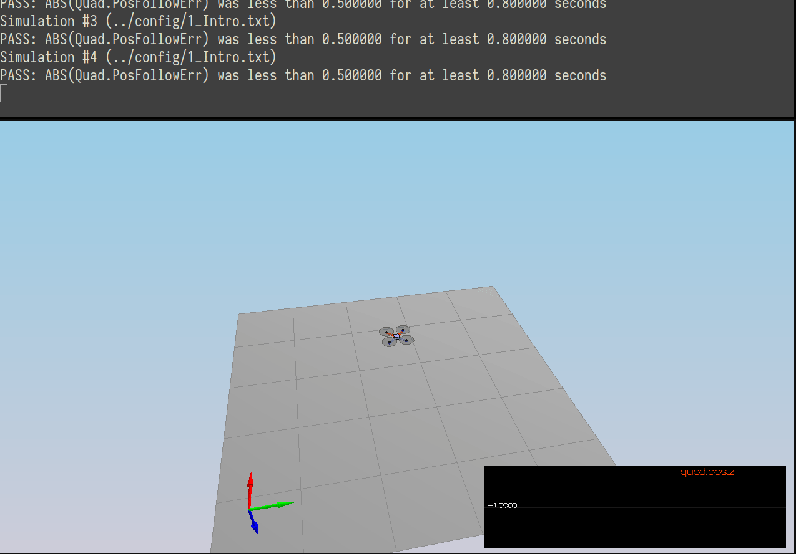
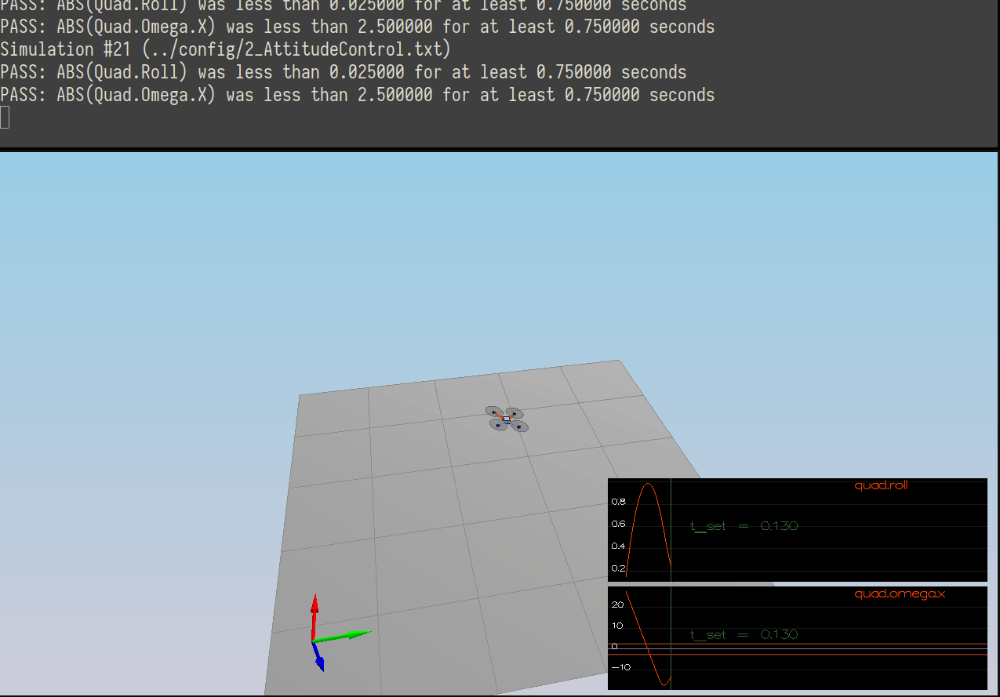
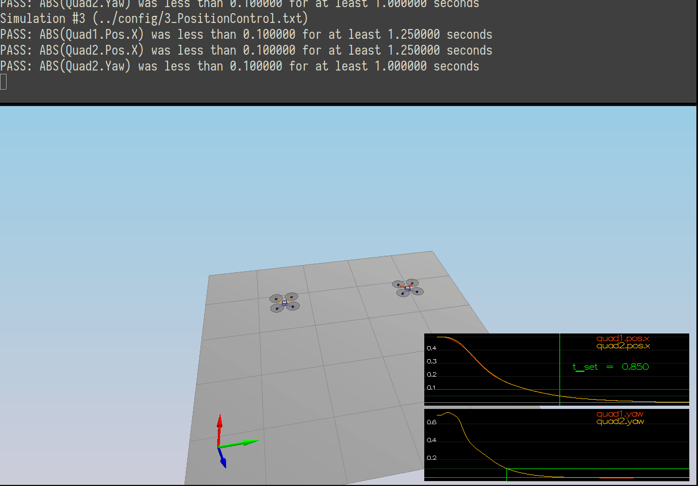
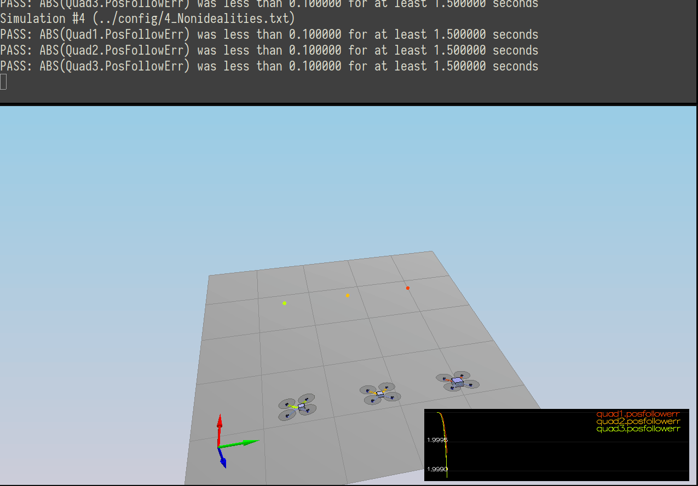
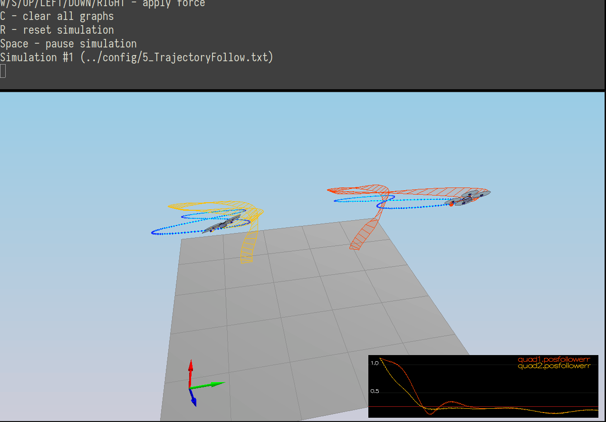

# Building a Controller

Project contains an implementation of a flight controller that satisfies given
scenarios.

## Implemented body rate control in C++

> The controller should be a proportional controller on body rates to commanded moments. The controller should take into account the moments of inertia of the drone when calculating the commanded moments.

Function `QuadControl::BodyRateControl` calculates `momentCmd` and takes into
account moments of inertia:

```
  V3F inertia(Ixx, Iyy, Izz);
```

## Implement roll pitch control in C++

> The controller should use the acceleration and thrust commands, in addition to the vehicle attitude to output a body rate command. The controller should account for the non-linear transformation from local accelerations to body rates. Note that the drone's mass should be accounted for when calculating the target angles.

Function `QuadControl::RollPitchControl` calculates roll and pitch commands. We
use rotation matrix `R` to calculate the components of resulting command.

`mass` of the drone is taken into account when `collAccCmd` is calculated:

```
  float collAccCmd = -collThrustCmd / mass;
```

## Implement altitude controller in C++

> The controller should use both the down position and the down velocity to command thrust. Ensure that the output value is indeed thrust (the drone's mass needs to be accounted for) and that the thrust includes the non-linear effects from non-zero roll/pitch angles.

> Additionally, the C++ altitude controller should contain an integrator to handle the weight non-idealities presented in scenario 4.

Function `QuadControl::AltitudeControl` implements the altitude control.
Variable `integratedAltitudeError` handles the weight non-idealities. Tests for
scenario 4 passed.

## Implement lateral position control in C++

> The controller should use the local NE position and velocity to generate a commanded local acceleration.

Function `QuadControl::LateralPositionControl` controls desired acceleration.
Velocity and acceleration are constrained with magnitude of the vector.

## Implement yaw control in C++

> The controller can be a linear/proportional heading controller to yaw rate commands (non-linear transformation not required).

Function `QuadControl::YawControl` controls yaw rate. `yawErr` constrainted to
`[-pi, pi]` interval.

## Implement calculating the motor commands given commanded thrust and moments in C++

> The thrust and moments should be converted to the appropriate 4 different desired thrust forces for the moments. Ensure that the dimensions of the drone are properly accounted for when calculating thrust from moments.

Function `QuadControl::GenerateMotorCommands` controls individual motors.
Individual forces are calculated in `f_N` variables and constrained to
`[minMotorThrust, maxMotorThrust]` interval.


# Flight Evaluation

> Your C++ controller is successfully able to fly the provided test trajectory and visually passes inspection of the scenarios leading up to the test trajectory.

All scenarios passed.

## Intro

<p align="center">
  
</p>

## AttitudeControl (scenario 2)

<p align="center">
  
</p>

## PositionControl (scenario 3)

<p align="center">
  
</p>

## Nonidealities (scenario 4)

<p align="center">
  
</p>

## TracectoryFollow (scenario 5)

Implements Extra Challenge 1

File `traj/MakePeriodicTrajectory.py` changed to track the velocity information:

```
if t == 0:
    the_file.write("," + fmt(0) + "," + fmt(0) + "," + fmt(0))
else:
    the_file.write(
        "," + fmt((x - px) / timestep) +
        "," + fmt((y - py) / timestep) +
        "," + fmt((z - pz) / timestep))
px, py, pz = x, y, z
```

Drone trajectories became much smoother.

<p align="center">
  
</p>

